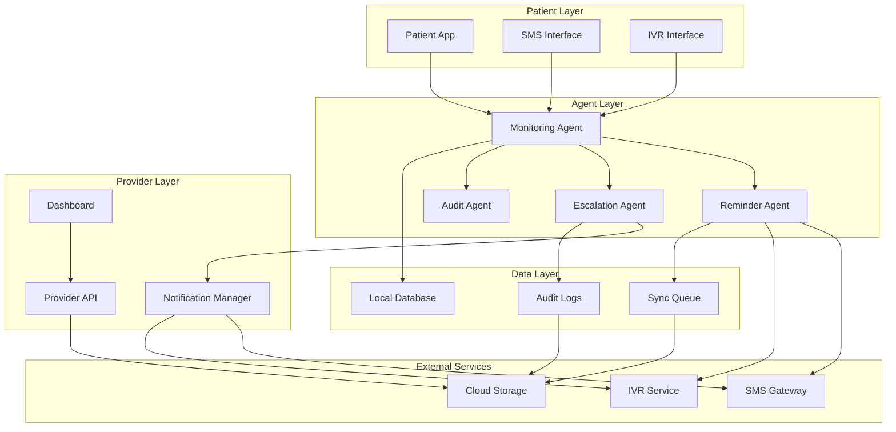

# CHAPS Design Document

## Overview

CHAPS (Community Health Agent for Post-Surgery Recovery) is designed as a distributed, offline-first healthcare system that operates autonomously while maintaining human oversight. The system employs an agent-based architecture where intelligent agents monitor patient recovery, make adaptive decisions, and escalate care when needed. The design prioritizes reliability, explainability, and operation in resource-constrained environments typical of Indian healthcare settings.

The system consists of three main layers: a patient-facing mobile application, an intelligent agent layer for decision-making, and a healthcare provider dashboard. All components are designed to operate offline-first with eventual consistency when connectivity is restored.

## Architecture

The CHAPS system follows a distributed agent architecture with the following key components:



### Agent-Based Decision Making

The system employs four specialized agents:

1. **Monitoring Agent**: Continuously processes patient data, identifies patterns, and maintains recovery state
2. **Reminder Agent**: Generates adaptive reminders based on patient behavior patterns and adherence history
3. **Escalation Agent**: Evaluates risk thresholds and triggers appropriate escalations to human caregivers
4. **Audit Agent**: Records all decisions with explainable rationale for transparency and compliance

## Components and Interfaces

### Patient Application

**Mobile Application Interface**:
- Lightweight Android app optimized for low-end devices
- Offline-first data storage using SQLite
- Simple UI with large buttons and clear visual indicators
- Voice input support for patients with limited literacy
- Automatic data synchronization when connectivity available

**Key Functions**:
- Pain level reporting (1-10 scale with visual indicators)
- Medication adherence tracking with photo confirmation
- Mobility check-ins with guided exercises
- Emergency contact activation
- Language preference management

### Communication Interfaces

**SMS Interface**:
- Bidirectional SMS communication for reminders and responses
- Template-based messages in local languages
- Delivery confirmation tracking
- Fallback to IVR when SMS fails

**IVR Interface**:
- Voice-based interaction in regional languages
- DTMF input for structured responses
- Text-to-speech for dynamic content
- Call-back functionality for failed connections

### Intelligent Agent Layer

**Monitoring Agent**:
```
class MonitoringAgent:
    - patient_state: PatientRecoveryState
    - pattern_analyzer: BehaviorPatternAnalyzer
    - risk_assessor: RiskAssessmentEngine
    
    + process_recovery_signal(signal: RecoverySignal)
    + analyze_adherence_patterns()
    + assess_risk_level() -> RiskLevel
    + update_recovery_trajectory()
```

**Reminder Agent**:
```
class ReminderAgent:
    - reminder_scheduler: AdaptiveScheduler
    - message_generator: LocalizedMessageGenerator
    - delivery_manager: MultiChannelDelivery
    
    + generate_adaptive_reminder(patient: Patient) -> Reminder
    + optimize_timing(adherence_history: AdherenceHistory)
    + select_delivery_channel(patient_preferences: Preferences)
```

**Escalation Agent**:
```
class EscalationAgent:
    - threshold_manager: RiskThresholdManager
    - escalation_router: EscalationRouter
    - contact_manager: ContactManager
    
    + evaluate_escalation_criteria(patient_state: PatientState) -> EscalationDecision
    + route_escalation(escalation: Escalation, contacts: ContactList)
    + track_escalation_response(escalation_id: String)
```

### Healthcare Provider Dashboard

**Dashboard Interface**:
- Responsive web application optimized for low-bandwidth
- Real-time patient status overview with risk-based prioritization
- Drill-down views for individual patient details
- Action recommendation engine
- Bulk operations for managing multiple patients

**Key Features**:
- Patient risk heat map with color-coded indicators
- Trend analysis charts for recovery metrics
- Alert management system with acknowledgment tracking
- Automated report generation for clinical review
- Integration with existing hospital information systems

## Data Models

### Core Data Structures

**Patient Model**:
```
Patient:
    - patient_id: UUID
    - demographics: PatientDemographics
    - surgery_details: SurgeryInformation
    - recovery_plan: RecoveryPlan
    - contact_preferences: CommunicationPreferences
    - assigned_providers: ProviderList
    - language_preference: LanguageCode
    - created_at: Timestamp
    - updated_at: Timestamp
```

**Recovery Signal Model**:
```
RecoverySignal:
    - signal_id: UUID
    - patient_id: UUID
    - signal_type: SignalType (PAIN, MEDICATION, MOBILITY, VITAL_SIGNS)
    - value: SignalValue
    - timestamp: Timestamp
    - source: DataSource (PATIENT_REPORT, DEVICE, CAREGIVER)
    - confidence_level: Float
    - metadata: JSON
```

**Intervention Model**:
```
Intervention:
    - intervention_id: UUID
    - patient_id: UUID
    - intervention_type: InterventionType (REMINDER, ESCALATION, ALERT)
    - trigger_reason: String
    - content: LocalizedContent
    - delivery_channels: ChannelList
    - scheduled_time: Timestamp
    - delivery_status: DeliveryStatus
    - response_received: Boolean
    - effectiveness_score: Float
```

**Audit Log Model**:
```
AuditLog:
    - log_id: UUID
    - patient_id: UUID
    - agent_id: String
    - action_type: ActionType
    - decision_rationale: ExplainableDecision
    - input_data: JSON
    - output_data: JSON
    - confidence_score: Float
    - timestamp: Timestamp
    - human_review_required: Boolean
```

### Risk Assessment Model

**Risk Calculation Framework**:
```
RiskAssessment:
    - patient_id: UUID
    - assessment_timestamp: Timestamp
    - risk_factors: RiskFactorList
    - composite_risk_score: Float (0.0 - 1.0)
    - risk_category: RiskCategory (LOW, MODERATE, HIGH, CRITICAL)
    - contributing_signals: SignalList
    - recommended_actions: ActionList
    - next_assessment_due: Timestamp
```

**Risk Factors**:
- Medication adherence trend (weight: 0.3)
- Pain level progression (weight: 0.25)
- Mobility improvement rate (weight: 0.2)
- Communication responsiveness (weight: 0.15)
- Historical escalation patterns (weight: 0.1)

## Design Correctness & Validation Principles

The following properties represent the intended correctness guarantees of the system and serve as design-time validation principles rather than immediate implementation requirements.

*A property is a characteristic or behavior that should hold true across all valid executions of a system—essentially, a formal statement about what the system should do. Properties serve as the bridge between human-readable specifications and machine-verifiable correctness guarantees.*

Before defining the correctness properties, I need to analyze the acceptance criteria from the requirements to determine which ones are testable as properties.

### Property 1: Recovery Signal Recording
*For any* patient and recovery signal (pain, mobility, medication), when the signal is reported, the system should create a timestamped record in local storage
**Validates: Requirements 1.1, 1.2, 1.3, 1.5**

### Property 2: Adaptive Reminder Behavior
*For any* patient with medication adherence below 80%, the system should increase reminder frequency, and for patients with 7+ days of good adherence, should reduce reminder intensity
**Validates: Requirements 2.1, 2.4**

### Property 3: Communication Channel Fallback
*For any* failed SMS delivery, the system should automatically attempt IVR delivery as fallback, and when both channels fail, should escalate to human intervention
**Validates: Requirements 2.3, 7.3, 7.5**

### Property 4: Risk-Based Escalation
*For any* patient whose recovery signals cross defined risk thresholds (pain >48hrs, adherence <60% for 3 days, multiple deterioration signals), the system should escalate to the appropriate caregiver level (Caregiver, ASHA_Worker, or Clinician)
**Validates: Requirements 3.1, 3.2, 3.3**

### Property 5: Escalation Persistence
*For any* triggered escalation, the system should continue sending alerts via both SMS and IVR until acknowledgment is received
**Validates: Requirements 3.4, 3.5**

### Property 6: Offline Operation Completeness
*For any* 7-day period without internet connectivity, the system should maintain full core functionality and queue all communications for delivery when connectivity returns
**Validates: Requirements 4.1, 4.3, 4.4**

### Property 7: Data Synchronization Round-Trip
*For any* locally stored data during offline operation, when connectivity is restored, synchronizing then querying should return equivalent data
**Validates: Requirements 4.2**

### Property 8: Storage Management
*For any* system reaching 90% storage capacity, older data should be compressed while preserving all critical recovery signals
**Validates: Requirements 4.5**

### Property 9: Dashboard Risk Ranking
*For any* set of patients with different risk levels, the dashboard should display them in correct risk-level order with appropriate visual indicators
**Validates: Requirements 5.1, 5.3**

### Property 10: Real-Time Dashboard Updates
*For any* significant patient status change, the dashboard should reflect the update immediately with current recovery signals and trend analysis
**Validates: Requirements 5.2, 5.4**

### Property 11: Comprehensive Audit Logging
*For any* system intervention or risk threshold crossing, an audit log entry should be created with explainable decision rationale and specific trigger information
**Validates: Requirements 6.1, 6.2**

### Property 12: Audit Log Integrity and Retention
*For any* audit log entry, it should be retained for minimum 1 year with cryptographic signature verification and provide human-readable explanations on request
**Validates: Requirements 6.3, 6.4, 6.5**

### Property 13: Multi-Channel Communication Support
*For any* communication requirement, the system should support both SMS and IVR channels with content adapted appropriately for each channel's capabilities
**Validates: Requirements 7.1, 7.2, 7.4**

### Property 14: Data Encryption Completeness
*For any* patient data, it should be encrypted at rest using AES-256 and in transmission using TLS 1.3
**Validates: Requirements 8.1, 8.2**

### Property 15: Access Control and Logging
*For any* attempt to access patient data, the system should authenticate and authorize the user and log the access attempt with user identification
**Validates: Requirements 8.3, 8.4**

### Property 16: Data Lifecycle Management
*For any* patient data older than 2 years, it should be automatically anonymized while preserving research value
**Validates: Requirements 8.5**

### Property 17: Bandwidth Optimization
*For any* data transmission, it should be compressed, and when bandwidth is limited, the system should prioritize critical data and operate in reduced-functionality mode
**Validates: Requirements 9.1, 9.2, 9.3**

### Property 18: Local Caching and Usage Tracking
*For any* frequently accessed data, it should be cached locally to reduce network requests, and data usage statistics should be provided to users
**Validates: Requirements 9.4, 9.5**

### Property 19: Comprehensive Language Support
*For any* patient interaction in their selected language preference, all communications should be delivered in that language with culturally appropriate medical terminology and correct pronunciation in IVR, with language switching available at any time
**Validates: Requirements 10.1, 10.2, 10.3, 10.4, 10.5**

## Error Handling

### Offline Operation Errors
- **Network Connectivity Loss**: System automatically switches to offline mode, queues all outbound communications, and continues core monitoring functions
- **Storage Capacity Exceeded**: Implements intelligent data compression and archival while preserving critical recovery signals
- **Device Resource Constraints**: Reduces background processing and optimizes memory usage while maintaining essential functionality

### Communication Failures
- **SMS Delivery Failures**: Automatic fallback to IVR system with retry logic and exponential backoff
- **IVR System Unavailable**: Escalation to human intervention with detailed failure logging
- **Language Translation Errors**: Fallback to English with notification to patient about language limitation

### Data Integrity Errors
- **Corrupted Local Data**: Automatic data validation with recovery from last known good state
- **Synchronization Conflicts**: Conflict resolution prioritizing patient safety and most recent clinical data
- **Audit Log Tampering**: Cryptographic signature verification with alerts for integrity violations

### Agent Decision Errors
- **Risk Assessment Failures**: Conservative escalation with human review requirement
- **Reminder Optimization Errors**: Fallback to standard reminder schedules with gradual re-learning
- **Escalation Routing Failures**: Broadcast escalation to all available contacts with priority ordering

## Testing Strategy

### Dual Testing Approach

The CHAPS system requires both unit testing and property-based testing for comprehensive coverage:

**Unit Tests** focus on:
- Specific examples of patient scenarios and recovery patterns
- Integration points between agents and external services
- Edge cases like network failures, storage limits, and device constraints
- Error conditions and recovery mechanisms
- Cultural and linguistic adaptation accuracy

**Property-Based Tests** focus on:
- Universal properties that hold across all patient data and system states
- Comprehensive input coverage through randomized patient scenarios
- Invariant preservation during offline/online transitions
- Correctness of agent decision-making across diverse conditions

### Property-Based Testing Configuration

- **Testing Framework**: Use Hypothesis (Python) or fast-check (TypeScript) for property-based testing
- **Test Iterations**: Minimum 100 iterations per property test to ensure statistical confidence
- **Test Tagging**: Each property test must reference its design document property with format:
  - **Feature: chaps, Property {number}: {property_text}**
- **Data Generation**: Custom generators for realistic patient data, recovery signals, and system states
- **Shrinking Strategy**: Implement custom shrinking for complex healthcare scenarios to identify minimal failing cases

### Integration Testing Strategy

- **End-to-End Scenarios**: Test complete patient journeys from surgery to recovery completion
- **Multi-Agent Coordination**: Verify proper interaction between monitoring, reminder, escalation, and audit agents
- **Offline-Online Transitions**: Test data consistency and synchronization across connectivity changes
- **Multi-Language Workflows**: Validate complete user experiences in different Indian languages
- **Healthcare Provider Workflows**: Test dashboard functionality and escalation handling from provider perspective

### Performance and Reliability Testing

- **Offline Duration Testing**: Verify 7-day offline operation under various usage patterns
- **Low-Resource Testing**: Test on devices with limited memory, storage, and processing power
- **Network Condition Testing**: Simulate poor connectivity, high latency, and intermittent connections
- **Load Testing**: Test system behavior with large numbers of patients and high message volumes
- **Failover Testing**: Verify graceful degradation and recovery from various failure scenarios