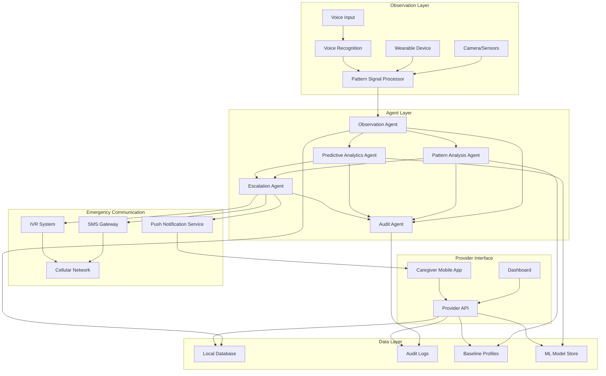

# CHAPS Design Document

## Overview

CHAPS (Continuous Health Alert and Pattern System) is an autonomous healthcare monitoring system that solves a life-or-death problem: humans cannot observe patients continuously, leading to missed critical changes and healthcare delays that cost lives. The system provides 24/7 continuous observation through behavioral pattern recognition, combining non-intrusive camera/sensor monitoring with wearable device data.

The design is built on four core principles:

1. **Continuous Observation**: 24/7 monitoring without human intervention
2. **Behavioral Pattern Recognition**: Detect clinically meaningful changes (movement, sleep, restlessness, inactivity)
3. **Multi-Modal Input**: Integrate camera/sensor data with wearable device vitals
4. **Emergency-First**: Critical alerts use SMS/IVR via cellular network, never depend on internet

The system is universally applicable across hospitals, homes, and elderly care facilities. It employs an autonomous agent architecture where AI agents observe, analyze patterns, escalate emergencies, and maintain explainable audit trails—all while preserving patient privacy.

## Architecture

The CHAPS system follows an autonomous agent architecture with five specialized agents working together, enhanced with voice interaction capabilities and mobile caregiver interface:



### Agent Responsibilities

**Observation Agent**:
- Processes camera/sensor Pattern_Signals
- Processes wearable device data (heart rate, motion, emergency button)
- Processes voice interaction data through Voice_Interaction_Module
- Maintains continuous data stream without recording surveillance footage or voice conversations
- Sends processed Pattern_Signals to Pattern Analysis Agent and Predictive Analytics Agent
- Monitors device connectivity and battery status

**Pattern Analysis Agent**:
- Establishes Recovery_Baseline for each patient
- Detects abnormal movement patterns (reduced, increased, sudden changes)
- Monitors sleep patterns and quality
- Identifies restlessness and concerning inactivity
- Correlates behavioral patterns with vital signs and voice-reported symptoms
- Calculates risk scores continuously
- Triggers escalations when thresholds are crossed

**Predictive Analytics Agent** (NEW):
- Analyzes historical pattern sequences to predict future risk trajectory
- Generates 6-12 hour risk forecasts using ML_Model
- Identifies early warning signs before they become emergencies
- Triggers proactive alerts to clinicians when deterioration is predicted
- Monitors ML_Model accuracy and triggers retraining when needed
- Supports federated learning for privacy-preserving model updates
- Operates offline without internet dependency

**Escalation Agent**:
- Executes emergency-first escalation protocol
- Uses SMS/IVR via cellular network (no internet dependency)
- Sends Push_Notifications to Caregiver_Mobile_App with SMS/IVR fallback
- Implements step-by-step escalation (Caregiver → Clinician → Backup)
- Continues escalation until acknowledgment received (from mobile app or SMS/IVR)
- Handles emergency button presses, fall detection, and voice emergency commands immediately
- Manages multi-language emergency communications

**Audit Agent**:
- Logs all agent decisions with explainable rationale
- Records which Pattern_Signals triggered each decision
- Logs predictive analytics forecasts and accuracy metrics
- Maintains comprehensive audit trail for compliance
- Provides human-readable explanations on request
- Ensures transparency in autonomous decision-making

## Components and Interfaces

### Observation System

**Camera/Sensor Infrastructure**:
- Non-intrusive visual monitoring (ceiling-mounted or wall-mounted)
- Motion sensors for activity detection
- Infrared sensors for night monitoring
- Local processing unit for Pattern_Signal extraction
- No surveillance recording—raw data deleted immediately after processing

**Pattern Signal Processor**:
```
class PatternSignalProcessor:
    - visual_analyzer: VisualPatternExtractor
    - motion_detector: MotionAnalyzer
    - privacy_filter: PrivacyPreservingProcessor
    
    + extract_movement_pattern(visual_data: RawVisual) -> MovementSignal
    + detect_sleep_indicators(visual_data: RawVisual) -> SleepSignal
    + identify_restlessness(motion_data: MotionData) -> RestlessnessSignal
    + assess_inactivity(motion_data: MotionData) -> InactivitySignal
    + delete_raw_data(visual_data: RawVisual)
```

**Key Features**:
- Real-time pattern extraction without storage
- Privacy-preserving processing (no identifiable images stored)
- Low-latency signal generation (<1 second)
- Operates independently without internet
- Visual indicator showing observation is active

### Wearable Device

**Simple Wearable Band**:
- Heart rate sensor (continuous monitoring)
- Accelerometer (motion and fall detection)
- Emergency button (one-press activation)
- Bluetooth Low Energy connectivity
- 7-day battery life minimum
- Water-resistant design

**Wearable Interface**:
```
class WearableDevice:
    - heart_rate_monitor: HeartRateS
ensor
    - motion_detector: AccelerometerSensor
    - emergency_button: EmergencyButtonHandler
    - battery_monitor: BatteryManager
    - connectivity_manager: BluetoothManager
    
    + measure_heart_rate() -> HeartRateReading
    + detect_motion() -> MotionData
    + detect_fall() -> FallEvent
    + handle_emergency_press() -> EmergencyEvent
    + check_battery_level() -> BatteryLevel
    + maintain_connection() -> ConnectionStatus
```

**Emergency Detection**:
- Fall detection: Sudden acceleration change + horizontal orientation
- Immobility detection: No motion for threshold period after normal activity
- Abnormal vitals: Heart rate outside patient-specific safe range
- Emergency button: Immediate trigger regardless of other signals

### Observation Agent

**Core Responsibilities**:
```
class ObservationAgent:
    - signal_processor: PatternSignalProcessor
    - wearable_interface: WearableDeviceInterface
    - data_router: SignalRouter
    - device_monitor: DeviceHealthMonitor
    
    + process_camera_signals(raw_data: RawVisual) -> PatternSignal
    + process_wearable_data(device_data: WearableData) -> VitalSignal
    + route_to_pattern_analysis(signal: PatternSignal)
    + monitor_device_health() -> DeviceStatus
    + alert_on_device_failure(failure: DeviceFailure)
```

**Signal Processing Pipeline**:
1. Receive raw data from cameras/sensors or wearable
2. Extract behavioral patterns (movement, sleep, restlessness, inactivity)
3. Delete raw visual data immediately
4. Send Pattern_Signals to Pattern Analysis Agent
5. Log processing activity to Audit Agent

**Device Health Monitoring**:
- Wearable battery level tracking
- Connectivity status monitoring
- Alert caregivers when devices need attention
- Graceful degradation when devices are offline

### Voice Interaction Module

**Natural Voice Interface**:
- Offline speech recognition (no internet required)
- Multi-language support (Hindi, English, Tamil, Telugu, Bengali, Marathi, Gujarati)
- Natural conversation flow (not rigid commands)
- Noise filtering for hospital and home environments
- Emergency phrase detection across all languages
- Voice activity detection

**Voice Interaction Interface**:
```
class VoiceInteractionModule:
    - speech_recognizer: OfflineSpeechRecognizer
    - nlp_processor: NaturalLanguageProcessor
    - symptom_extractor: SymptomExtractor
    - emergency_detector: EmergencyPhraseDetector
    - noise_filter: AudioNoiseFilter
    - voice_feedback: TextToSpeechEngine
    - privacy_manager: VoicePrivacyManager
    
    + recognize_voice_command(audio: AudioData) -> VoiceCommand
    + extract_pain_level(voice_input: VoiceCommand) -> PainLevelSignal
    + extract_symptoms(voice_input: VoiceCommand) -> SymptomSignal
    + detect_emergency_phrase(voice_input: VoiceCommand) -> EmergencyEvent
    + provide_voice_feedback(message: String, language: LanguageCode)
    + delete_audio_data(audio: AudioData)
```

**Voice Command Processing**:
1. Receive audio input from patient
2. Filter environmental noise
3. Recognize speech using offline model
4. Extract clinical information (pain level, symptoms, emergency)
5. Delete raw audio immediately
6. Generate Pattern_Signals for analysis
7. Provide voice confirmation to patient

**Supported Voice Commands**:
- **Pain Reporting**: "My pain is 7 out of 10", "I'm in severe pain", "Pain level 5"
- **Symptom Description**: "I feel nauseous", "I'm dizzy", "Difficulty breathing", "I can't sleep"
- **Emergency Requests**: "Help me", "I need help", "Emergency", "Call doctor"
- **Medication Confirmation**: "I took my medicine", "Medication taken"
- **General Status**: "I'm feeling better", "I'm uncomfortable", "I need assistance"

**Voice Data Privacy**:
- No voice recording storage
- Immediate audio deletion after pattern extraction
- Local processing only (no cloud transmission)
- Visual indicator when voice monitoring active
- Patient can disable voice monitoring anytime


### Pattern Analysis Agent

**Core Responsibilities**:
```
class PatternAnalysisAgent:
    - baseline_manager: RecoveryBaselineManager
    - movement_analyzer: MovementPatternAnalyzer
    - sleep_analyzer: SleepPatternAnalyzer
    - restlessness_detector: RestlessnessDetector
    - inactivity_monitor: InactivityMonitor
    - risk_calculator: RiskScoreCalculator
    - multi_modal_integrator: MultiModalIntegrator
    
    + establish_baseline(patient_id: UUID, initial_signals: SignalList) -> RecoveryBaseline
    + analyze_movement(signal: MovementSignal, baseline: RecoveryBaseline) -> MovementAssessment
    + analyze_sleep(signal: SleepSignal, baseline: RecoveryBaseline) -> SleepAssessment
    + detect_restlessness(signal: RestlessnessSignal) -> RestlessnessAssessment
    + monitor_inactivity(signal: InactivitySignal) -> InactivityAssessment
    + integrate_patterns(assessments: AssessmentList) -> RiskScore
    + trigger_escalation(risk_score: RiskScore, patient_id: UUID)
```

**Baseline Establishment**:
- First 24 hours: Collect normal behavioral patterns
- Establish patient-specific thresholds for movement, sleep, activity
- Account for surgery type, age, mobility level
- Continuously refine baseline as recovery progresses
- Store baseline profiles locally for offline operation

**Movement Pattern Analysis**:
- **Reduced Movement**: Compare current activity to baseline, flag if significantly lower
- **Increased Movement**: Detect agitation/restlessness above baseline
- **Sudden Changes**: Identify rapid shifts in activity level
- **Clinical Significance**: Low movement → complications; High restless movement → distress

**Sleep Pattern Analysis**:
- Track sleep duration against baseline
- Count wake-ups during sleep periods
- Distinguish sleep from concerning inactivity
- Correlate poor sleep with pain/medication issues
- Monitor sleep quality trends over recovery

**Restlessness Detection**:
- Count position changes per time period
- Identify constant movement without rest
- Correlate with other patterns (pain, breathing)
- Escalate persistent restlessness to caregivers

**Inactivity Monitoring**:
- Track periods of no movement
- Account for normal sleep periods
- Flag missed activity check-ins
- Immediate escalation for critical inactivity thresholds

**Risk Score Calculation**:
```
RiskScore = weighted_sum(
    movement_deviation * 0.25,
    sleep_quality * 0.20,
    restlessness_level * 0.20,
    inactivity_concern * 0.25,
    vital_signs_abnormality * 0.10
)

Risk Categories:
- LOW: 0.0 - 0.3 (normal recovery)
- MODERATE: 0.3 - 0.6 (alert caregiver)
- HIGH: 0.6 - 0.8 (alert clinician)
- CRITICAL: 0.8 - 1.0 (emergency escalation)
```


### Escalation Agent

**Core Responsibilities**:
```
class EscalationAgent:
    - protocol_manager: EscalationProtocolManager
    - sms_gateway: SMSGatewayInterface
    - ivr_system: IVRSystemInterface
    - contact_manager: ContactManager
    - acknowledgment_tracker: AcknowledgmentTracker
    - language_adapter: MultiLanguageAdapter
    
    + trigger_emergency(patient_id: UUID, reason: EscalationReason)
    + execute_protocol(escalation: Escalation) -> EscalationResult
    + send_sms_alert(contact: Contact, message: AlertMessage) -> DeliveryStatus
    + make_ivr_call(contact: Contact, message: AlertMessage) -> CallStatus
    + wait_for_acknowledgment(escalation_id: UUID, timeout: Duration) -> AckStatus
    + escalate_to_next_level(escalation: Escalation)
```

**Emergency-First Communication**:
- **Primary**: SMS via cellular network (no internet required)
- **Fallback**: IVR automated call via cellular network
- **Never**: Internet-dependent apps, Wi-Fi, or web notifications
- **Rationale**: "Emergencies cannot wait for Wi-Fi or apps to load"

**Step-by-Step Escalation Protocol**:
```
1. Detect emergency condition
2. Alert Caregiver via SMS
3. Wait for acknowledgment (timeout: 2 minutes)
4. If no ack: Alert Caregiver via IVR call
5. Wait for acknowledgment (timeout: 2 minutes)
6. If no ack: Alert Clinician via SMS
7. Wait for acknowledgment (timeout: 3 minutes)
8. If no ack: Alert Clinician via IVR call
9. Wait for acknowledgment (timeout: 3 minutes)
10. If no ack: Alert all backup contacts simultaneously
11. Continue until acknowledgment received
```

**Multi-Language Support**:
- SMS alerts in patient's preferred language
- IVR calls with native pronunciation
- Support for Hindi, English, Tamil, Telugu, Bengali, Marathi, Gujarati
- Simple, clear emergency language
- Fallback to English if preference not set

**Escalation Triggers**:
- Emergency button press: Immediate escalation
- Fall detection: Immediate escalation
- Sudden immobility: Immediate escalation
- Critical risk score (>0.8): Immediate escalation
- High risk score (>0.6): Alert clinician
- Moderate risk score (>0.3): Alert caregiver
- Persistent restlessness: Alert caregiver
- Prolonged inactivity: Immediate escalation

### Predictive Analytics Agent

**Core Responsibilities**:
```
class PredictiveAnalyticsAgent:
    - ml_model: TimeSeriesMLModel
    - trajectory_predictor: RiskTrajectoryPredictor
    - pattern_sequence_analyzer: PatternSequenceAnalyzer
    - early_warning_detector: EarlyWarningDetector
    - model_accuracy_monitor: ModelAccuracyMonitor
    - federated_learner: FederatedLearningManager
    - explainable_predictor: ExplainablePredictionEngine
    
    + analyze_pattern_sequence(signals: PatternSignalList) -> RiskTrajectory
    + predict_future_risk(patient_id: UUID, forecast_hours: Int) -> RiskForecast
    + identify_early_warnings(trajectory: RiskTrajectory) -> EarlyWarningList
    + trigger_proactive_alert(forecast: RiskForecast, patient_id: UUID)
    + monitor_model_accuracy(predictions: PredictionList, outcomes: OutcomeList) -> AccuracyMetrics
    + retrain_model(training_data: AnonymizedDataset)
    + update_model_federated(local_updates: ModelUpdates)
```

**Risk Trajectory Prediction**:
- Analyzes sequences of Pattern_Signals over time
- Identifies trends indicating future deterioration
- Generates 6-12 hour risk forecasts
- Predicts when risk score will cross thresholds
- Provides confidence intervals for predictions

**ML Model Architecture**:
```
TimeSeriesMLModel:
    - input_features: PatternSequenceFeatures (movement trends, sleep quality trends, vital sign trends, voice-reported symptoms)
    - sequence_length: 24-48 hours of historical patterns
    - output: Risk trajectory (predicted risk scores at 1h, 3h, 6h, 12h intervals)
    - model_type: LSTM or Transformer for time-series prediction
    - training_data: Anonymized historical patterns from multiple patients
    - offline_operation: Model runs locally without internet
```

**Feature Engineering**:
- **Movement Trend Features**: Rate of change in activity level, acceleration of decline
- **Sleep Quality Trend Features**: Deteriorating sleep patterns, increasing wake frequency
- **Vital Signs Trend Features**: Heart rate variability trends, motion pattern changes
- **Multi-Modal Correlation Features**: Correlation between behavioral and vital sign changes
- **Voice Symptom Features**: Frequency and severity of voice-reported symptoms
- **Temporal Features**: Time of day, days since surgery, recovery phase

**Early Warning Detection**:
- Identifies subtle pattern changes that precede deterioration
- Detects combinations of patterns that historically led to emergencies
- Flags patients entering high-risk trajectory before symptoms worsen
- Provides clinicians with lead time for intervention

**Proactive Alert Generation**:
```
ProactiveAlert:
    - alert_type: PREDICTED_DETERIORATION
    - patient_id: UUID
    - current_risk_score: Float
    - predicted_risk_trajectory: RiskTrajectoryList
    - predicted_deterioration_time: Timestamp (6-12 hours ahead)
    - early_warning_signs: PatternList
    - recommended_intervention: InterventionSuggestion
    - prediction_confidence: Float (0.0 - 1.0)
    - explainable_rationale: String
```

**Model Accuracy Monitoring**:
- Tracks prediction accuracy vs actual outcomes
- Calculates precision, recall, false positive rate
- Monitors for model drift over time
- Triggers retraining when accuracy drops below threshold (e.g., <80%)
- Logs accuracy metrics to Audit_Agent

**Federated Learning**:
- Trains model improvements locally on each deployment
- Aggregates model updates without sharing raw patient data
- Synchronizes model improvements across installations when connectivity available
- Maintains patient privacy during collaborative learning
- Allows opt-out of federated learning participation

**Explainable Predictions**:
```
ExplainablePrediction:
    - prediction_summary: "Patient likely to deteriorate in 8 hours"
    - contributing_factors: ["Movement declining 15% per day", "Sleep quality worsening", "Increased restlessness at night"]
    - pattern_trends: TrendVisualization
    - similar_historical_cases: Int (e.g., "Based on 47 similar pattern sequences")
    - confidence_explanation: "High confidence (0.87) due to consistent trend over 36 hours"
```

**Integration with Pattern Analysis**:
- Receives same Pattern_Signals as Pattern_Analysis_Agent
- Operates independently without interfering with real-time monitoring
- Proactive alerts complement reactive emergency detection
- Both agents log to Audit_Agent for comprehensive decision trail


### Audit Agent

**Core Responsibilities**:
```
class AuditAgent:
    - log_manager: AuditLogManager
    - explanation_generator: ExplainableAIEngine
    - integrity_verifier: CryptographicVerifier
    - query_interface: AuditQueryInterface
    
    + log_decision(agent: AgentID, decision: Decision, rationale: Rationale)
    + log_pattern_signal(signal: PatternSignal, assessment: Assessment)
    + log_escalation(escalation: Escalation, triggers: TriggerList)
    + generate_explanation(decision_id: UUID) -> HumanReadableExplanation
    + verify_log_integrity(log_entry: AuditLog) -> IntegrityStatus
    + query_audit_trail(patient_id: UUID, time_range: TimeRange) -> AuditLogList
```

**Audit Log Structure**:
```
AuditLog:
    - log_id: UUID
    - timestamp: Timestamp
    - patient_id: UUID
    - agent_id: AgentID (Observation, PatternAnalysis, Escalation)
    - decision_type: DecisionType
    - input_signals: PatternSignalList
    - decision_output: DecisionOutput
    - rationale: ExplainableRationale
    - risk_score: Float (if applicable)
    - escalation_triggered: Boolean
    - cryptographic_signature: Signature
```

**Explainable Rationale Format**:
```
ExplainableRationale:
    - decision_summary: String (e.g., "Escalated to caregiver due to persistent restlessness")
    - contributing_factors: FactorList (e.g., ["Restlessness 3x baseline", "Sleep disruption", "Increased heart rate"])
    - threshold_crossed: ThresholdInfo (e.g., "Risk score 0.65 exceeded HIGH threshold 0.60")
    - baseline_comparison: BaselineComparison (e.g., "Movement 40% below recovery baseline")
    - confidence_level: Float (0.0 - 1.0)
```

**Audit Trail Queries**:
- Why was this escalation triggered?
- What patterns led to this risk score?
- Show all decisions for patient in last 24 hours
- Verify integrity of audit logs
- Generate compliance reports

### Caregiver Mobile App

**Core Responsibilities**:
```
class CaregiverMobileApp:
    - push_notification_handler: PushNotificationHandler
    - patient_dashboard: MultiPatientDashboard
    - offline_manager: OfflineDataManager
    - sync_engine: DataSynchronizationEngine
    - alert_history: AlertHistoryManager
    - authentication: SecureAuthenticationManager
    - api_client: SecureAPIClient
    
    + receive_push_notification(alert: PushNotification) -> NotificationDisplay
    + acknowledge_escalation(escalation_id: UUID) -> AcknowledgmentResult
    + display_patient_dashboard(caregiver_id: UUID) -> PatientList
    + sync_offline_data() -> SyncResult
    + query_alert_history(patient_id: UUID, filters: AlertFilters) -> AlertHistoryList
    + authenticate_user(credentials: Credentials) -> AuthenticationResult
```

**Push Notification System**:
- Real-time alerts for escalations
- Rich notification content (patient name, risk score, escalation reason, patterns)
- One-tap acknowledgment from notification
- Fallback to SMS/IVR if push delivery fails
- Priority levels (critical, high, moderate)
- Sound and vibration patterns for different alert types

**Multi-Patient Dashboard**:
```
PatientDashboardView:
    - patient_list: PatientList (sorted by risk score descending)
    - risk_indicators: Visual risk badges (green/yellow/orange/red)
    - active_alerts: AlertList (highlighted)
    - pattern_summaries: BehavioralPatternSummary per patient
    - trend_indicators: Arrows showing improving/declining/stable
    - last_update_timestamp: Timestamp
    - offline_indicator: Boolean
```

**Patient Detail View**:
```
PatientDetailView:
    - patient_info: PatientProfile
    - current_risk_score: Float with visual gauge
    - risk_trajectory: RiskTrendGraph (if predictive analytics available)
    - current_patterns: BehavioralPatternList
    - vital_signs: LatestVitalSigns
    - recent_alerts: AlertHistoryList (last 24 hours)
    - pattern_timeline: TimelineVisualization
    - voice_reported_symptoms: SymptomList (if voice interaction enabled)
    - acknowledgment_button: One-tap escalation acknowledgment
```

**Offline Operation**:
- Local SQLite database for patient data caching
- Queue acknowledgments and actions when offline
- Automatic sync when connectivity restored
- Offline indicator in UI
- Prioritize emergency data in sync queue
- Conflict resolution (server data wins for safety)

**Data Synchronization**:
```
SyncStrategy:
    - sync_frequency: Every 30 seconds when online
    - sync_priority: Emergency alerts > Patient status > Historical data
    - conflict_resolution: Server authoritative (safety-first)
    - bandwidth_optimization: Delta sync, compression
    - sync_queue: Persistent queue for offline actions
    - sync_status: Visual indicator (synced, syncing, offline)
```

**Alert History and Tracking**:
```
AlertHistoryEntry:
    - alert_id: UUID
    - patient_id: UUID
    - timestamp: Timestamp
    - alert_type: AlertType
    - risk_score: Float
    - escalation_reason: String
    - acknowledged_by: CaregiverID
    - acknowledgment_time: Timestamp
    - response_time: Duration (time to acknowledgment)
    - resolution_notes: String
    - outcome: AlertOutcome (resolved, escalated, false_positive)
```

**Security and Authentication**:
- Biometric authentication (fingerprint, face recognition)
- PIN fallback
- Session timeout after inactivity
- Encrypted local data storage (AES-256)
- Secure HTTPS API communication
- Certificate pinning for API security
- Role-based access control (caregiver, clinician, nurse)
- Automatic logout on device lock

**Role-Based Views**:
- **Caregiver**: Single patient focus, simplified interface
- **Nurse**: Multi-patient view, shift management features
- **Clinician**: All patients, detailed clinical data, predictive analytics

**Low-Bandwidth Optimization**:
- Compressed data transfer (gzip)
- Incremental updates (only changed data)
- Image/graph lazy loading
- Configurable data usage limits
- 2G/3G network support
- Data usage statistics and controls
- Offline-first architecture minimizes bandwidth needs

**Battery Efficiency**:
- Background sync optimization
- Push notification instead of polling
- Efficient local database queries
- Minimal wake locks
- Adaptive sync frequency based on battery level


## Data Models

### Core Data Structures

**Patient Profile**:
```
Patient:
    - patient_id: UUID
    - demographics: Demographics (age, gender, language_preference)
    - medical_context: MedicalContext (surgery_type, risk_factors, mobility_level)
    - recovery_baseline: RecoveryBaseline
    - care_setting: CareSetting (HOSPITAL, HOME, ELDERLY_CARE)
    - assigned_contacts: ContactList (caregivers, clinicians, backup)
    - device_assignments: DeviceList (wearable_id, camera_ids)
    - created_at: Timestamp
    - updated_at: Timestamp
```

**Recovery Baseline**:
```
RecoveryBaseline:
    - patient_id: UUID
    - established_at: Timestamp
    - movement_baseline: MovementBaseline
    - sleep_baseline: SleepBaseline
    - activity_baseline: ActivityBaseline
    - vital_signs_baseline: VitalSignsBaseline
    - baseline_confidence: Float (0.0 - 1.0, increases over 24 hours)
```

**Movement Baseline**:
```
MovementBaseline:
    - average_activity_level: Float (movements per hour)
    - typical_position_changes: Int (per hour)
    - mobility_range: MobilityRange (BEDRIDDEN, LIMITED, MODERATE, FULL)
    - normal_activity_periods: TimeRangeList
    - rest_periods: TimeRangeList
```

**Sleep Baseline**:
```
SleepBaseline:
    - typical_sleep_duration: Duration (hours)
    - typical_sleep_start: TimeOfDay
    - typical_sleep_end: TimeOfDay
    - normal_wake_frequency: Int (per night)
    - sleep_quality_indicators: SleepQualityMetrics
```

**Pattern Signal**:
```
PatternSignal:
    - signal_id: UUID
    - patient_id: UUID
    - signal_type: SignalType (MOVEMENT, SLEEP, RESTLESSNESS, INACTIVITY, VITAL_SIGNS)
    - signal_data: SignalData
    - timestamp: Timestamp
    - source: DataSource (CAMERA, SENSOR, WEARABLE)
    - confidence: Float (0.0 - 1.0)
    - processed_locally: Boolean
```

**Signal Data Variants**:
```
MovementSignal:
    - activity_level: Float
    - position_changes: Int
    - movement_type: MovementType (REDUCED, NORMAL, INCREASED, AGITATED)

SleepSignal:
    - sleep_state: SleepState (ASLEEP, AWAKE, RESTLESS)
    - sleep_duration: Duration
    - wake_count: Int
    - sleep_quality: Float (0.0 - 1.0)

RestlessnessSignal:
    - restlessness_level: Float (0.0 - 1.0)
    - position_change_frequency: Int
    - continuous_movement_duration: Duration

InactivitySignal:
    - inactivity_duration: Duration
    - last_movement_timestamp: Timestamp
    - inactivity_type: InactivityType (SLEEP, CONCERNING, CRITICAL)

VitalSignsSignal:
    - heart_rate: Int (bpm)
    - heart_rate_variability: Float
    - motion_detected: Boolean
    - fall_detected: Boolean
    - emergency_button_pressed: Boolean
```


**Risk Assessment**:
```
RiskAssessment:
    - assessment_id: UUID
    - patient_id: UUID
    - timestamp: Timestamp
    - risk_score: Float (0.0 - 1.0)
    - risk_category: RiskCategory (LOW, MODERATE, HIGH, CRITICAL)
    - contributing_patterns: PatternContributionList
    - baseline_deviations: DeviationList
    - recommended_action: RecommendedAction
    - escalation_triggered: Boolean
```

**Pattern Contribution**:
```
PatternContribution:
    - pattern_type: PatternType
    - deviation_from_baseline: Float
    - weight: Float
    - contribution_to_risk: Float
    - clinical_significance: String
```

**Escalation Record**:
```
Escalation:
    - escalation_id: UUID
    - patient_id: UUID
    - trigger_timestamp: Timestamp
    - escalation_reason: EscalationReason
    - risk_score: Float
    - trigger_patterns: PatternSignalList
    - escalation_level: EscalationLevel (CAREGIVER, CLINICIAN, EMERGENCY)
    - protocol_steps: ProtocolStepList
    - acknowledgment_received: Boolean
    - acknowledgment_timestamp: Timestamp
    - acknowledged_by: ContactID
    - resolution_notes: String
```

**Protocol Step**:
```
ProtocolStep:
    - step_number: Int
    - contact: Contact
    - communication_method: CommunicationMethod (SMS, IVR)
    - message_sent: Boolean
    - sent_timestamp: Timestamp
    - delivery_status: DeliveryStatus
    - acknowledgment_received: Boolean
    - timeout_duration: Duration
```

**Contact**:
```
Contact:
    - contact_id: UUID
    - name: String
    - role: ContactRole (CAREGIVER, CLINICIAN, BACKUP)
    - phone_number: PhoneNumber
    - language_preference: LanguageCode
    - priority_level: Int (1 = highest)
    - availability_schedule: AvailabilitySchedule
    - mobile_app_enabled: Boolean
    - push_notification_token: String (if mobile app installed)
```

**Risk Trajectory** (NEW):
```
RiskTrajectory:
    - trajectory_id: UUID
    - patient_id: UUID
    - generated_at: Timestamp
    - forecast_window: Duration (6-12 hours)
    - predicted_risk_points: RiskPointList
    - early_warning_signs: PatternList
    - prediction_confidence: Float (0.0 - 1.0)
    - contributing_trends: TrendList
    - recommended_intervention: InterventionSuggestion
```

**Risk Point**:
```
RiskPoint:
    - forecast_timestamp: Timestamp (future time)
    - predicted_risk_score: Float (0.0 - 1.0)
    - confidence_interval: ConfidenceInterval (lower, upper bounds)
    - risk_category: RiskCategory (LOW, MODERATE, HIGH, CRITICAL)
```

**ML Model Metadata** (NEW):
```
MLModelMetadata:
    - model_id: UUID
    - model_version: String
    - trained_at: Timestamp
    - training_dataset_size: Int (number of anonymized patient sequences)
    - accuracy_metrics: AccuracyMetrics
    - last_accuracy_check: Timestamp
    - retraining_threshold: Float (e.g., 0.80)
    - federated_learning_enabled: Boolean
    - model_file_path: String (local storage)
```

**Accuracy Metrics**:
```
AccuracyMetrics:
    - precision: Float
    - recall: Float
    - f1_score: Float
    - false_positive_rate: Float
    - false_negative_rate: Float
    - mean_absolute_error: Float (for risk score predictions)
    - evaluation_period: TimeRange
```

**Voice Command Signal** (NEW):
```
VoiceCommandSignal:
    - signal_id: UUID
    - patient_id: UUID
    - timestamp: Timestamp
    - command_type: VoiceCommandType (PAIN_LEVEL, SYMPTOM, EMERGENCY, MEDICATION_CONFIRM, STATUS)
    - recognized_text: String
    - language: LanguageCode
    - confidence: Float (0.0 - 1.0)
    - extracted_data: VoiceExtractedData
    - audio_deleted: Boolean (always true)
```

**Voice Extracted Data**:
```
VoiceExtractedData:
    - pain_level: Int (1-10, if applicable)
    - symptoms: SymptomList (if applicable)
    - emergency_detected: Boolean
    - medication_confirmed: Boolean
    - general_status: PatientStatus (BETTER, WORSE, UNCOMFORTABLE, STABLE)
```

**Symptom**:
```
Symptom:
    - symptom_type: SymptomType (PAIN, NAUSEA, DIZZINESS, BREATHING_DIFFICULTY, FATIGUE, OTHER)
    - severity: SeverityLevel (MILD, MODERATE, SEVERE)
    - location: String (if applicable, e.g., "chest", "abdomen")
    - duration: Duration (if mentioned)
    - description: String (natural language)
```

**Push Notification** (NEW):
```
PushNotification:
    - notification_id: UUID
    - escalation_id: UUID
    - patient_id: UUID
    - recipient_contact_id: UUID
    - sent_at: Timestamp
    - delivery_status: DeliveryStatus (SENT, DELIVERED, FAILED, ACKNOWLEDGED)
    - notification_content: NotificationContent
    - priority: NotificationPriority (CRITICAL, HIGH, MODERATE)
    - fallback_triggered: Boolean (true if SMS/IVR fallback used)
```

**Notification Content**:
```
NotificationContent:
    - title: String (e.g., "Patient Alert: John Doe")
    - body: String (e.g., "High risk score (0.72) - Increased restlessness detected")
    - patient_name: String
    - risk_score: Float
    - escalation_reason: String
    - current_patterns: PatternSummaryList
    - action_required: String (e.g., "Acknowledge to confirm receipt")
```

**Mobile App Session** (NEW):
```
MobileAppSession:
    - session_id: UUID
    - caregiver_id: UUID
    - device_id: String
    - device_type: DeviceType (ANDROID, IOS)
    - app_version: String
    - login_timestamp: Timestamp
    - last_activity: Timestamp
    - session_token: String (encrypted)
    - offline_mode: Boolean
    - sync_status: SyncStatus
```

**Sync Status**:
```
SyncStatus:
    - last_sync_timestamp: Timestamp
    - pending_acknowledgments: Int
    - pending_actions: Int
    - sync_queue_size: Int
    - last_sync_error: String (if applicable)
```


## Correctness Properties

*A property is a characteristic or behavior that should hold true across all valid executions of a system—essentially, a formal statement about what the system should do. Properties serve as the bridge between human-readable specifications and machine-verifiable correctness guarantees.*

### Acceptance Criteria Testing Prework

Before defining correctness properties, I analyzed each acceptance criterion to determine testability:

**Requirement 1: Continuous Behavioral Observation**
1.1. THE Observation_System SHALL monitor patients continuously without interruption
  Thoughts: This is about system uptime and continuous operation. We can test that the system maintains observation over extended periods without gaps.
  Testable: yes - property

1.2. WHEN observing patient behavior, THE Observation_System SHALL process visual/sensor data into Pattern_Signals without recording surveillance footage
  Thoughts: This is about privacy preservation. We can verify that no raw visual data is stored after processing.
  Testable: yes - property

1.3. THE Observation_System SHALL send Pattern_Signals to the Observation_Agent for analysis
  Thoughts: This is about data flow. We can verify that all processed signals reach the agent.
  Testable: yes - property

1.4. THE Observation_System SHALL operate in hospitals, homes, and elderly care facilities
  Thoughts: This is about deployment flexibility, not a functional requirement we can test in code.
  Testable: no

1.5. WHEN privacy is required, THE Observation_System SHALL process data locally without external transmission
  Thoughts: This is about data locality. We can verify that processing happens locally and no external network calls are made.
  Testable: yes - property

**Requirement 2: Movement Pattern Detection**
2.1. WHEN a patient shows reduced movement compared to Recovery_Baseline, THE Pattern_Analysis_Agent SHALL flag potential complications
  Thoughts: This is a universal rule about pattern detection. We can generate random baselines and movement patterns and verify flagging behavior.
  Testable: yes - property

2.2. WHEN a patient shows sudden increase in movement, THE Pattern_Analysis_Agent SHALL flag potential discomfort
  Thoughts: Similar to 2.1, this is testable across all movement patterns.
  Testable: yes - property

2.3. WHEN a patient shows sudden decrease in movement, THE Pattern_Analysis_Agent SHALL flag potential emergency
  Thoughts: Similar to 2.1 and 2.2, testable as a property.
  Testable: yes - property

2.4. THE Pattern_Analysis_Agent SHALL establish Recovery_Baseline for each patient within first 24 hours
  Thoughts: This is about timing and baseline establishment. We can verify that baselines are created within the time window.
  Testable: yes - property

2.5. THE Pattern_Analysis_Agent SHALL compare current movement patterns against Recovery_Baseline continuously
  Thoughts: This is about continuous comparison. We can verify that every new pattern is compared to baseline.
  Testable: yes - property

**Requirement 3: Sleep Pattern Monitoring**
3.1-3.5: All sleep pattern criteria follow similar logic to movement patterns
  Thoughts: These are all testable as properties—we can generate random sleep patterns and verify detection logic.
  Testable: yes - property (for all)

**Requirement 4: Restlessness Detection**
4.1-4.5: All restlessness criteria are pattern-based
  Thoughts: Testable as properties with generated restlessness patterns.
  Testable: yes - property (for all)

**Requirement 5: Inactivity Monitoring**
5.1-5.5: All inactivity criteria are pattern-based
  Thoughts: Testable as properties with generated inactivity scenarios.
  Testable: yes - property (for all)

**Requirement 6: Wearable Device Integration**
6.1-6.5: Device measurement and signal processing
  Thoughts: Testable as properties—verify that device data flows correctly to agents.
  Testable: yes - property (for all)

**Requirement 7: Wearable Emergency Detection**
7.1-7.5: Emergency trigger conditions
  Thoughts: Testable as properties—verify immediate escalation on emergency events.
  Testable: yes - property (for all)

**Requirement 8: Emergency-First Escalation Without Internet**
8.1-8.5: Communication channel requirements
  Thoughts: Testable as properties—verify SMS/IVR usage and no internet dependency.
  Testable: yes - property (for all)

**Requirement 9: Step-by-Step Escalation Protocol**
9.1-9.5: Protocol execution
  Thoughts: Testable as properties—verify correct escalation sequence.
  Testable: yes - property (for all)

**Requirement 10: Multi-Modal Pattern Integration**
10.1-10.5: Pattern correlation and integration
  Thoughts: Testable as properties—verify correct integration of multiple signal sources.
  Testable: yes - property (for all)

**Requirement 11: Privacy-Preserving Observation**
11.1-11.5: Privacy requirements
  Thoughts: Testable as properties—verify no surveillance storage and immediate deletion.
  Testable: yes - property (for all)

**Requirement 12: Autonomous Agent Decision-Making**
12.1-12.5: Agent autonomy
  Thoughts: Testable as properties—verify agents make decisions without human intervention.
  Testable: yes - property (for all)

**Requirement 13: Explainable Decision Audit Trail**
13.1-13.5: Audit logging
  Thoughts: Testable as properties—verify all decisions are logged with rationale.
  Testable: yes - property (for all)

**Requirement 14: Universal Applicability**
14.1-14.5: Multi-setting operation
  Thoughts: 14.1-14.3 are deployment scenarios (not testable). 14.4-14.5 are testable as properties.
  Testable: 14.4-14.5 yes - property, others no

**Requirement 15: Early Risk Detection**
15.1-15.5: Risk scoring and escalation
  Thoughts: Testable as properties—verify risk calculation and escalation thresholds.
  Testable: yes - property (for all)

**Requirement 16: Offline Emergency Operation**
16.1-16.5: Offline functionality
  Thoughts: Testable as properties—verify operation without internet.
  Testable: yes - property (for all)

**Requirement 17: Wearable Device Reliability**
17.1-17.5: Device reliability features
  Thoughts: 17.1, 17.4, 17.5 are hardware specs (not testable in software). 17.2-17.3 are testable as properties.
  Testable: 17.2-17.3 yes - property, others no

**Requirement 18: Real-Time Pattern Analysis**
18.1-18.5: Timing requirements
  Thoughts: Testable as properties—verify processing latency and real-time updates.
  Testable: yes - property (for all)

**Requirement 19: Multi-Language Emergency Communication**
19.1-19.5: Language support
  Thoughts: Testable as properties—verify correct language delivery.
  Testable: yes - property (for all)

**Requirement 20: Healthcare Provider Dashboard**
20.1-20.5: Dashboard functionality
  Thoughts: Testable as properties—verify correct risk ranking and real-time updates.
  Testable: yes - property (for all)

### Property Reflection

After analyzing all testable criteria, I identified the following consolidation opportunities:

- Movement pattern detection (2.1, 2.2, 2.3) can be combined into one comprehensive property about movement deviation detection
- Sleep pattern monitoring (3.1-3.5) can be consolidated into fewer properties covering sleep quality and anomaly detection
- Emergency escalation properties (7.1-7.5, 8.1-8.5, 9.1-9.5) have overlap and can be consolidated around escalation correctness
- Privacy properties (11.1-11.5) can be combined into comprehensive privacy preservation property
- Audit logging properties (13.1-13.5) can be consolidated into comprehensive audit trail property


### Correctness Properties

### Property 1: Continuous Observation Without Gaps
*For any* time period during active monitoring, the Observation_System should process and send Pattern_Signals continuously without interruption gaps
**Validates: Requirements 1.1, 1.3**

### Property 2: Privacy-Preserving Processing
*For any* visual data processed by the Observation_System, raw surveillance footage should not be stored, and all data should be processed locally into Pattern_Signals with immediate deletion of source data
**Validates: Requirements 1.2, 1.5, 11.1, 11.2, 11.3**

### Property 3: Movement Deviation Detection
*For any* patient with established Recovery_Baseline, when current movement patterns deviate significantly (reduced, increased, or sudden changes), the Pattern_Analysis_Agent should flag the deviation with appropriate clinical significance
**Validates: Requirements 2.1, 2.2, 2.3, 2.5**

### Property 4: Baseline Establishment Timeliness
*For any* new patient, the Pattern_Analysis_Agent should establish a Recovery_Baseline within 24 hours of monitoring start, with baseline confidence increasing over time
**Validates: Requirements 2.4**

### Property 5: Sleep Pattern Anomaly Detection
*For any* patient with established sleep baseline, when sleep duration, wake frequency, or sleep quality deviates from baseline, the Pattern_Analysis_Agent should flag potential complications
**Validates: Requirements 3.1, 3.2, 3.3, 3.5**

### Property 6: Sleep vs Inactivity Distinction
*For any* period of patient stillness, the Pattern_Analysis_Agent should correctly distinguish between normal sleep and concerning inactivity based on sleep indicators and timing
**Validates: Requirements 3.4, 5.3**

### Property 7: Restlessness Pattern Recognition
*For any* patient showing repeated position changes or constant movement without rest, the Pattern_Analysis_Agent should detect restlessness and correlate with other behavioral patterns
**Validates: Requirements 4.1, 4.2, 4.3, 4.5**

### Property 8: Persistent Restlessness Escalation
*For any* patient with restlessness exceeding threshold duration, the Pattern_Analysis_Agent should trigger escalation to Caregiver
**Validates: Requirements 4.4**

### Property 9: Critical Inactivity Detection
*For any* patient showing prolonged inactivity (accounting for sleep periods) or missed activity check-ins, the Pattern_Analysis_Agent should flag potential emergency and trigger escalation when critical thresholds are exceeded
**Validates: Requirements 5.1, 5.2, 5.4, 5.5**

### Property 10: Wearable Data Integration
*For any* wearable device data (heart rate, motion, emergency button), the Observation_Agent should process it into Pattern_Signals and route to Pattern_Analysis_Agent
**Validates: Requirements 6.1, 6.2, 6.3, 6.4**

### Property 11: Immediate Emergency Escalation
*For any* emergency event (fall detection, sudden immobility, emergency button press, abnormal vitals), the Escalation_Agent should trigger immediate emergency escalation without delay
**Validates: Requirements 6.5, 7.1, 7.2, 7.3, 7.5**

### Property 12: Emergency Communication Without Internet
*For any* emergency escalation, the Escalation_Agent should use SMS_Alert and IVR_Call via cellular network, never depending on internet connectivity, with SMS-to-IVR fallback on failure
**Validates: Requirements 7.4, 8.1, 8.2, 8.3, 8.4, 8.5**

### Property 13: Step-by-Step Escalation Protocol Execution
*For any* triggered escalation, the Escalation_Agent should execute the protocol in correct sequence (Caregiver → Clinician → Backup), waiting for acknowledgment at each step and continuing until acknowledgment is received
**Validates: Requirements 9.1, 9.2, 9.3, 9.4, 9.5**

### Property 14: Multi-Modal Pattern Integration
*For any* patient with multiple Pattern_Signal sources (camera/sensor and wearable), the Pattern_Analysis_Agent should integrate all signals into unified risk assessment, prioritizing wearable vitals for emergency decisions
**Validates: Requirements 10.1, 10.2, 10.3, 10.4, 10.5**

### Property 15: Autonomous Decision-Making
*For any* pattern analysis or escalation decision, the agents should act autonomously without requiring human approval, with immediate action on emergency conditions
**Validates: Requirements 12.1, 12.2, 12.3, 12.4**

### Property 16: Comprehensive Audit Logging
*For any* agent decision (observation, pattern analysis, escalation), the Audit_Agent should create a log entry with explainable rationale, contributing Pattern_Signals, and decision triggers
**Validates: Requirements 12.5, 13.1, 13.2, 13.3, 13.5**

### Property 17: Audit Trail Retention and Integrity
*For any* audit log entry, it should be retained for minimum 1 year, provide human-readable explanations on request, and maintain cryptographic integrity
**Validates: Requirements 13.4**

### Property 18: Baseline Adaptation Across Settings
*For any* care setting (hospital, home, elderly care), the Pattern_Analysis_Agent should adapt Recovery_Baseline appropriately and use identical Escalation_Protocol
**Validates: Requirements 14.4, 14.5**

### Property 19: Risk-Based Escalation Thresholds
*For any* patient risk score, when it exceeds defined thresholds (moderate: 0.3, high: 0.6, critical: 0.8), the appropriate escalation level should be triggered (caregiver, clinician, emergency)
**Validates: Requirements 15.1, 15.2, 15.3, 15.4**

### Property 20: Early Deterioration Detection
*For any* patient with declining behavioral patterns, the Pattern_Analysis_Agent should detect deterioration trends before they reach critical levels
**Validates: Requirements 15.5**

### Property 21: Offline Emergency Operation
*For any* period without internet connectivity, the CHAPS_System should maintain core observation, pattern analysis, and emergency escalation functions using cellular SMS/IVR exclusively
**Validates: Requirements 16.1, 16.2, 16.4, 16.5**

### Property 22: Offline Data Synchronization
*For any* non-emergency data collected during offline operation, when connectivity is restored, the data should be queued and synchronized
**Validates: Requirements 16.3**

### Property 23: Wearable Device Health Monitoring
*For any* wearable device with low battery or lost connection, the Observation_Agent should alert Caregiver within appropriate timeframes
**Validates: Requirements 17.2, 17.3**

### Property 24: Real-Time Pattern Processing
*For any* Pattern_Signal received, the Pattern_Analysis_Agent should process it and generate alerts within specified latency (concerning: 30s, emergency: 10s), with continuous risk score updates
**Validates: Requirements 18.1, 18.2, 18.3, 18.4, 18.5**

### Property 25: Multi-Language Emergency Delivery
*For any* emergency communication, the Escalation_Agent should deliver SMS_Alert and IVR_Call in patient's preferred language with correct pronunciation, using simple clear language
**Validates: Requirements 19.1, 19.2, 19.3, 19.4, 19.5**

### Property 26: Dashboard Risk-Based Prioritization
*For any* set of patients, the dashboard should display them ranked by current risk score with appropriate visual indicators and real-time updates on significant status changes
**Validates: Requirements 20.1, 20.2, 20.3, 20.4, 20.5**

### Property 27: Risk Trajectory Prediction Accuracy
*For any* patient with established baseline and sufficient historical pattern data, the Predictive_Analytics_Agent should generate risk trajectory predictions for 6-12 hour forecast window with explainable rationale
**Validates: Requirements 21.1, 21.2, 21.5**

### Property 28: Early Warning Detection Before Emergencies
*For any* patient entering deterioration trajectory, the Predictive_Analytics_Agent should identify early warning signs and alert clinicians before risk score reaches critical threshold
**Validates: Requirements 21.3, 21.4**

### Property 29: ML Model Accuracy Monitoring and Retraining
*For any* ML_Model in production, the Predictive_Analytics_Agent should continuously monitor prediction accuracy and trigger retraining when accuracy drops below threshold
**Validates: Requirements 22.3, 22.4**

### Property 30: Offline ML Model Operation
*For any* period without internet connectivity, the ML_Model should continue generating risk trajectory predictions using locally stored model
**Validates: Requirements 22.5**

### Property 31: Federated Learning Privacy Preservation
*For any* federated learning model update, the Predictive_Analytics_Agent should aggregate improvements locally without transmitting raw patient data
**Validates: Requirements 23.1, 23.2, 23.3, 23.5**

### Property 32: Voice Pain Level Recognition
*For any* voice command reporting pain level in supported languages, the Voice_Interaction_Module should correctly extract pain level (1-10 scale) and generate Pattern_Signal
**Validates: Requirements 24.1, 24.2, 24.4**

### Property 33: Voice Symptom Extraction
*For any* natural symptom description in supported languages, the Voice_Interaction_Module should extract clinically relevant information and send to Pattern_Analysis_Agent
**Validates: Requirements 25.1, 25.2, 25.3, 25.4**

### Property 34: Voice Emergency Phrase Detection
*For any* emergency phrase in supported languages, the Voice_Interaction_Module should trigger immediate emergency escalation regardless of exact phrasing
**Validates: Requirements 26.1, 26.2, 26.3, 26.4, 26.5**

### Property 35: Voice Data Privacy Preservation
*For any* voice interaction, the Voice_Interaction_Module should process audio into Pattern_Signals only, with immediate deletion of raw audio data and no external transmission
**Validates: Requirements 27.1, 27.2, 27.3, 27.4**

### Property 36: Push Notification with SMS/IVR Fallback
*For any* escalation, the Escalation_Agent should attempt Push_Notification delivery first, with automatic fallback to SMS_Alert and IVR_Call on failure
**Validates: Requirements 28.1, 28.2, 28.5**

### Property 37: Mobile App Rich Context Display
*For any* escalation notification, the Caregiver_Mobile_App should display patient risk score, current patterns, escalation reason, and allow one-tap acknowledgment
**Validates: Requirements 28.3, 28.4**

### Property 38: Mobile App Multi-Patient Risk Prioritization
*For any* caregiver managing multiple patients, the Caregiver_Mobile_App should display patients ranked by risk score with real-time status updates
**Validates: Requirements 29.1, 29.2, 29.3, 29.4, 29.5**

### Property 39: Mobile App Offline Operation and Sync
*For any* period without connectivity, the Caregiver_Mobile_App should operate with cached data, queue acknowledgments, and automatically sync when connectivity restored
**Validates: Requirements 30.1, 30.2, 30.3, 30.4, 30.5**

### Property 40: Mobile App Alert History Tracking
*For any* patient, the Caregiver_Mobile_App should display complete alert history with resolution status, response times, and trend analysis
**Validates: Requirements 31.1, 31.2, 31.3, 31.4, 31.5**

### Property 41: Mobile App Secure Authentication
*For any* mobile app access attempt, the Caregiver_Mobile_App should require secure authentication, encrypt local data, and implement role-based access control
**Validates: Requirements 32.1, 32.2, 32.3, 32.4, 32.5**

### Property 42: Mobile App Low-Bandwidth Optimization
*For any* data transfer, the Caregiver_Mobile_App should optimize for low-bandwidth networks, prioritize critical alerts, and operate efficiently on 2G/3G
**Validates: Requirements 33.1, 33.2, 33.3, 33.4, 33.5**

### Property 43: Predictive Analytics Integration with Pattern Analysis
*For any* Pattern_Signal, both Pattern_Analysis_Agent and Predictive_Analytics_Agent should receive it, with independent processing and no interference with real-time emergency escalations
**Validates: Requirements 34.1, 34.2, 34.3, 34.4, 34.5**

### Property 44: Voice Interaction Integration with Observation
*For any* voice-based Pattern_Signal, it should be generated in same format as other sources and integrated with behavioral patterns by Pattern_Analysis_Agent
**Validates: Requirements 35.1, 35.2, 35.3, 35.4, 35.5**

### Property 45: Mobile App Integration with Escalation Protocol
*For any* escalation, the Escalation_Agent should integrate Push_Notification as additional channel while maintaining SMS/IVR as primary for critical emergencies
**Validates: Requirements 36.1, 36.2, 36.3, 36.4, 36.5**


## Error Handling

### Observation System Errors

**Camera/Sensor Failures**:
- **Camera Offline**: Alert caregiver immediately, rely on wearable device data exclusively
- **Sensor Malfunction**: Log error, attempt automatic recovery, escalate if recovery fails
- **Pattern Extraction Failure**: Use last known good pattern, flag data quality issue
- **Processing Overload**: Prioritize emergency pattern detection, queue non-critical processing

**Privacy Violations**:
- **Raw Data Storage Detected**: Immediate alert to administrator, automatic data deletion
- **External Transmission Attempt**: Block transmission, log security incident
- **Unauthorized Access**: Lock system, alert security team

### Wearable Device Errors

**Connectivity Issues**:
- **Bluetooth Disconnection**: Attempt automatic reconnection for 5 minutes, then alert caregiver
- **Intermittent Connection**: Buffer data on device, sync when connection stable
- **Complete Device Failure**: Escalate to caregiver, rely on camera/sensor observation exclusively

**Battery and Hardware**:
- **Low Battery (<20%)**: Alert caregiver to charge device
- **Critical Battery (<5%)**: Escalate to clinician, device may fail soon
- **Sensor Malfunction**: Validate readings against baseline, flag suspicious data
- **Fall Detection False Positive**: Require confirmation from inactivity patterns before escalation

### Pattern Analysis Errors

**Baseline Establishment Failures**:
- **Insufficient Data**: Extend baseline period to 48 hours, use conservative thresholds
- **Inconsistent Patterns**: Flag patient for manual baseline review by clinician
- **Extreme Variability**: Use wider tolerance ranges, increase monitoring frequency

**Risk Assessment Errors**:
- **Conflicting Signals**: Prioritize vital signs over behavioral patterns for emergency decisions
- **Missing Data**: Use last known good assessment, flag data gap in audit log
- **Confidence Below Threshold**: Escalate to human review rather than autonomous decision
- **Pattern Recognition Failure**: Fallback to rule-based thresholds, log AI failure

### Escalation Errors

**Communication Failures**:
- **SMS Delivery Failure**: Immediate fallback to IVR call
- **IVR Call Failure**: Retry with exponential backoff, escalate to next contact level
- **All Channels Failed**: Log critical failure, broadcast to all contacts simultaneously
- **No Acknowledgment Received**: Continue escalation indefinitely until human response

**Protocol Execution Errors**:
- **Contact Unavailable**: Skip to next contact in protocol immediately
- **Invalid Phone Number**: Use backup contact, alert administrator to update contact info
- **Language Translation Error**: Fallback to English, note language issue in message
- **Timeout Exceeded**: Escalate to next level, do not wait indefinitely

### Data Integrity Errors

**Storage Errors**:
- **Database Corruption**: Restore from last known good state, alert administrator
- **Storage Full**: Archive old non-critical data, preserve all emergency and audit logs
- **Write Failure**: Retry with exponential backoff, escalate if persistent

**Synchronization Errors**:
- **Sync Conflict**: Prioritize most recent data, flag conflict for human review
- **Network Timeout**: Queue for retry, continue offline operation
- **Data Loss Detected**: Alert administrator, attempt recovery from backup

### Agent Coordination Errors

**Inter-Agent Communication**:
- **Message Loss**: Implement retry logic with acknowledgment
- **Agent Unresponsive**: Restart agent, escalate to system administrator if restart fails
- **Circular Dependencies**: Implement timeout and fallback to safe default behavior

**Decision Conflicts**:
- **Multiple Escalations**: Merge into single escalation with highest priority level
- **Contradictory Assessments**: Use most conservative (safest) assessment
- **Race Conditions**: Implement proper locking and sequencing

### Predictive Analytics Errors

**Model Prediction Failures**:
- **Low Confidence Prediction**: Flag prediction as uncertain, rely on real-time pattern analysis
- **Model Unavailable**: Continue operation with Pattern_Analysis_Agent only, log model failure
- **Prediction Timeout**: Use last known trajectory, attempt prediction retry
- **Contradictory Prediction**: Prioritize real-time risk score over predicted trajectory for immediate decisions

**Model Training and Accuracy**:
- **Accuracy Below Threshold**: Trigger automatic retraining, alert administrator
- **Training Data Insufficient**: Extend data collection period, use conservative thresholds
- **Model Drift Detected**: Schedule retraining, increase monitoring frequency
- **Retraining Failure**: Rollback to previous model version, alert administrator

**Federated Learning Errors**:
- **Sync Conflict**: Use most recent model version, log conflict
- **Update Corruption**: Reject corrupted update, maintain current model
- **Network Failure During Sync**: Queue update for retry, continue with local model

### Voice Interaction Errors

**Speech Recognition Failures**:
- **Low Confidence Recognition**: Ask patient to repeat, provide voice feedback
- **Unrecognized Language**: Attempt recognition in all supported languages, fallback to English
- **Noise Interference**: Request quieter environment via voice feedback, increase noise filtering
- **No Speech Detected**: Timeout after 10 seconds, provide voice prompt

**Emergency Detection Errors**:
- **False Positive Emergency**: Require confirmation from patient, log false positive
- **Ambiguous Command**: Ask for clarification via voice feedback
- **Emergency Phrase in Conversation**: Use context analysis to distinguish, err on side of caution

**Voice Processing Errors**:
- **Audio Input Failure**: Alert caregiver, rely on other observation methods
- **Symptom Extraction Failure**: Log raw recognized text for manual review, flag for clinician attention
- **Text-to-Speech Failure**: Continue operation silently, log TTS error

### Mobile App Errors

**Push Notification Failures**:
- **Notification Not Delivered**: Immediate fallback to SMS_Alert
- **App Not Installed**: Use SMS/IVR exclusively, log app status
- **Token Expired**: Refresh push token, retry notification, fallback to SMS if refresh fails
- **Device Offline**: Queue notification, send SMS/IVR immediately for critical alerts

**Synchronization Errors**:
- **Sync Conflict**: Server data wins (safety-first), notify user of conflict
- **Partial Sync Failure**: Retry failed items, continue with successful syncs
- **Sync Timeout**: Queue for retry, continue offline operation
- **Data Corruption**: Discard corrupted data, re-fetch from server

**Authentication and Security Errors**:
- **Authentication Failure**: Lock account after 3 attempts, require password reset
- **Session Expired**: Force re-authentication, preserve queued actions
- **Certificate Pinning Failure**: Block connection, alert security team
- **Encryption Error**: Fail securely, do not transmit unencrypted data

**Offline Operation Errors**:
- **Cache Full**: Purge oldest non-critical data, preserve emergency data
- **Database Corruption**: Restore from backup, re-sync from server
- **Queue Overflow**: Prioritize emergency acknowledgments, drop low-priority items


## Testing Strategy

### Dual Testing Approach

The CHAPS system requires both unit testing and property-based testing for comprehensive coverage. These approaches are complementary and both necessary:

**Unit Tests** focus on:
- Specific examples of behavioral patterns and emergency scenarios
- Integration points between agents and external services (SMS, IVR, wearables)
- Edge cases like device failures, network outages, and data corruption
- Error conditions and recovery mechanisms
- Multi-language communication accuracy
- Privacy preservation verification

**Property-Based Tests** focus on:
- Universal properties that hold across all patient data and behavioral patterns
- Comprehensive input coverage through randomized patient scenarios
- Invariant preservation during offline/online transitions
- Correctness of agent decision-making across diverse conditions
- Risk score calculation consistency
- Escalation protocol correctness

### Property-Based Testing Configuration

**Testing Framework**:
- Python: Use Hypothesis for property-based testing
- TypeScript/JavaScript: Use fast-check for property-based testing
- Minimum 100 iterations per property test (due to randomization)

**Test Tagging**:
Each property test must reference its design document property with format:
```
# Feature: chaps, Property {number}: {property_text}
```

**Custom Generators**:
- **Patient Generator**: Random demographics, medical contexts, baselines
- **Pattern Signal Generator**: Random movement, sleep, restlessness, inactivity signals
- **Vital Signs Generator**: Random heart rate, motion data within realistic ranges
- **Behavioral Pattern Generator**: Sequences of patterns representing recovery trajectories
- **Emergency Scenario Generator**: Falls, button presses, critical inactivity
- **Contact List Generator**: Random caregiver/clinician contact configurations

**Shrinking Strategy**:
- Implement custom shrinking for complex healthcare scenarios
- Minimize failing test cases to simplest reproducible example
- Preserve temporal relationships in pattern sequences during shrinking

### Integration Testing Strategy

**End-to-End Scenarios**:
- Complete patient journey from admission to recovery completion
- Emergency detection and escalation full cycle
- Offline operation with eventual synchronization
- Multi-agent coordination across observation, analysis, escalation, audit

**Multi-Agent Coordination Tests**:
- Verify proper signal flow: Observation → Pattern Analysis → Escalation → Audit
- Test concurrent pattern processing from multiple sources
- Validate agent recovery from failures
- Test decision consistency across agent restarts

**Offline-Online Transition Tests**:
- Verify continuous operation during network loss
- Test data queue management during offline periods
- Validate synchronization correctness when connectivity restored
- Test emergency escalation via cellular during internet outage

**Privacy and Security Tests**:
- Verify no raw visual data storage
- Test immediate deletion of source data after processing
- Validate local processing without external transmission
- Test audit log integrity and cryptographic signatures

**Multi-Language Workflow Tests**:
- Validate complete emergency escalation in each supported language
- Test language fallback mechanisms
- Verify pronunciation accuracy in IVR calls
- Test language switching during active monitoring

**Healthcare Provider Workflow Tests**:
- Test dashboard risk ranking accuracy
- Validate real-time updates on patient status changes
- Test escalation acknowledgment handling
- Verify audit trail query functionality

### Performance and Reliability Testing

**Real-Time Processing Tests**:
- Verify pattern processing latency (<30s for concerning, <10s for emergency)
- Test continuous risk score updates without lag
- Validate alert generation timing
- Test system responsiveness under high pattern signal volume

**Offline Duration Tests**:
- Verify 7-day offline operation without degradation
- Test data queue management over extended offline periods
- Validate battery life of wearable devices
- Test cellular communication reliability

**Device Constraint Tests**:
- Test on low-resource hardware (limited memory, CPU)
- Validate operation with poor cellular signal
- Test with intermittent device connectivity
- Verify graceful degradation under resource constraints

**Load and Stress Tests**:
- Test with large numbers of patients (100+, 1000+)
- Validate high-frequency pattern signal processing
- Test concurrent emergency escalations
- Verify system stability under sustained load

**Failover and Recovery Tests**:
- Test agent restart and recovery
- Validate data integrity after crashes
- Test backup contact escalation
- Verify audit log preservation during failures

### Compliance and Safety Testing

**Medical Device Compliance**:
- Validate accuracy of vital sign measurements
- Test emergency detection reliability (fall, immobility)
- Verify escalation timing meets safety requirements
- Test fail-safe behaviors

**Privacy Compliance**:
- Verify HIPAA/GDPR compliance for data handling
- Test data anonymization for research
- Validate access control and authentication
- Test audit trail completeness for compliance reporting

**Safety Critical Testing**:
- Test emergency escalation under all failure modes
- Verify no single point of failure for critical alerts
- Test redundancy in communication channels
- Validate that system failures default to safe behavior (escalate rather than ignore)


### Voice Interaction Testing

**Voice Recognition Accuracy Tests**:
- Test pain level recognition accuracy across all 7 languages
- Test symptom extraction from natural language descriptions
- Test emergency phrase detection with variations and accents
- Validate noise filtering in hospital and home environments
- Test voice feedback delivery in all languages
- Verify recognition confidence scoring

**Voice Integration Tests**:
- Test voice command integration with pattern analysis
- Validate voice-based Pattern_Signal generation
- Test voice data privacy (no recording, immediate deletion)
- Verify voice emergency escalation full cycle
- Test voice interaction with concurrent camera/wearable monitoring

**Voice Error Handling Tests**:
- Test low confidence recognition handling
- Test unrecognized language fallback
- Test noise interference recovery
- Test false positive emergency detection
- Test audio input failure recovery

### Predictive Analytics Testing

**Prediction Accuracy Tests**:
- Test risk trajectory prediction accuracy on held-out test set
- Validate 6-12 hour forecast window accuracy
- Test early warning detection before emergencies
- Verify prediction confidence calibration
- Test model performance across different patient demographics

**Model Robustness Tests**:
- Test with noisy input data
- Test with missing pattern signals
- Test with edge case patient trajectories
- Validate model behavior with out-of-distribution data
- Test model stability over time (drift detection)

**Model Lifecycle Tests**:
- Test ML model accuracy monitoring
- Test model retraining triggers
- Validate model version management
- Test model rollback on failure
- Verify offline model operation

**Explainability Tests**:
- Verify all predictions include explainable rationale
- Test feature importance extraction
- Validate similar case retrieval
- Test prediction confidence explanation
- Verify clinician comprehension of explanations

**Federated Learning Tests**:
- Test local model update aggregation
- Verify no raw data transmission
- Test model convergence across multiple sites
- Validate privacy preservation during aggregation
- Test sync conflict resolution

### Mobile App Testing

**Push Notification Tests**:
- Test push notification delivery and fallback to SMS/IVR
- Validate notification content (risk score, patterns, reason)
- Test one-tap escalation acknowledgment
- Verify notification priority levels
- Test notification delivery on app not installed

**Multi-Patient Dashboard Tests**:
- Test patient list risk-based prioritization
- Validate real-time status updates
- Test drill-down to patient detail view
- Verify active alert highlighting
- Test dashboard with 50+ patients

**Offline Operation Tests**:
- Test mobile app offline operation for 24+ hours
- Validate acknowledgment queuing
- Test automatic sync when connectivity restored
- Verify offline indicator display
- Test data cache management

**Alert History Tests**:
- Test complete alert history display
- Validate resolution status tracking
- Test response time calculation
- Verify filtering by type, date, severity
- Test trend analysis visualization

**Security Tests**:
- Test biometric authentication
- Validate PIN fallback
- Test session timeout
- Verify local data encryption (AES-256)
- Test secure API communication
- Validate role-based access control

**Low-Bandwidth Tests**:
- Test operation on 2G/3G networks
- Validate data compression
- Test priority-based data transfer
- Verify data usage statistics
- Test operation with poor cellular signal

**Battery Efficiency Tests**:
- Test background sync optimization
- Validate push notification efficiency vs polling
- Test adaptive sync frequency
- Verify minimal wake locks
- Test battery usage over 24 hours

### Integration Tests for New Enhancements

**Predictive + Reactive Monitoring Integration**:
- Test simultaneous operation of Pattern_Analysis_Agent and Predictive_Analytics_Agent
- Verify no interference between real-time and predictive alerts
- Test proactive alert followed by reactive emergency
- Validate audit logging of both agent types

**Voice + Camera + Wearable Integration**:
- Test concurrent pattern signal processing from all three sources
- Verify voice-reported symptoms correlate with behavioral patterns
- Test voice emergency during camera-detected fall
- Validate multi-modal risk assessment

**Mobile App + SMS/IVR Integration**:
- Test push notification with SMS/IVR fallback
- Verify acknowledgment from mobile app stops SMS/IVR escalation
- Test mobile app offline triggers SMS/IVR
- Validate escalation protocol with mixed acknowledgment sources

**End-to-End Enhanced Workflow**:
- Test complete patient journey with all enhancements
- Verify predictive alert → proactive intervention → outcome tracking
- Test voice-based symptom reporting → pattern analysis → escalation
- Validate mobile app notification → acknowledgment → resolution tracking

### Performance Tests for New Enhancements

**Voice Recognition Performance**:
- Test voice recognition latency (<2s)
- Validate concurrent voice processing for multiple patients
- Test voice recognition under high CPU load
- Verify voice processing on low-power devices

**Predictive Analytics Performance**:
- Test risk trajectory generation time (<5s)
- Validate ML model inference latency
- Test model training time
- Verify federated learning aggregation performance

**Mobile App Performance**:
- Test notification delivery latency (<3s)
- Validate dashboard load time with 50+ patients
- Test sync performance with large data queues
- Verify app responsiveness on low-end devices

### Additional Custom Generators

**Voice Command Generator**:
- Generate random voice commands in all 7 languages
- Generate pain levels (1-10) with natural language variations
- Generate symptom descriptions with clinical relevance
- Generate emergency phrases with variations
- Generate noise-corrupted audio samples

**Risk Trajectory Generator**:
- Generate random historical pattern sequences
- Generate deterioration trajectories
- Generate stable recovery trajectories
- Generate edge case trajectories (rapid deterioration, oscillating patterns)

**Mobile App State Generator**:
- Generate random offline/online states
- Generate sync scenarios (partial sync, conflict, timeout)
- Generate notification delivery states (delivered, failed, acknowledged)
- Generate multi-patient scenarios with varying risk levels
